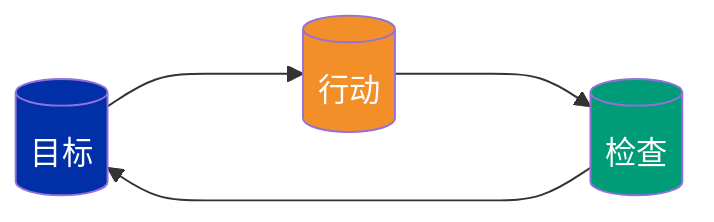
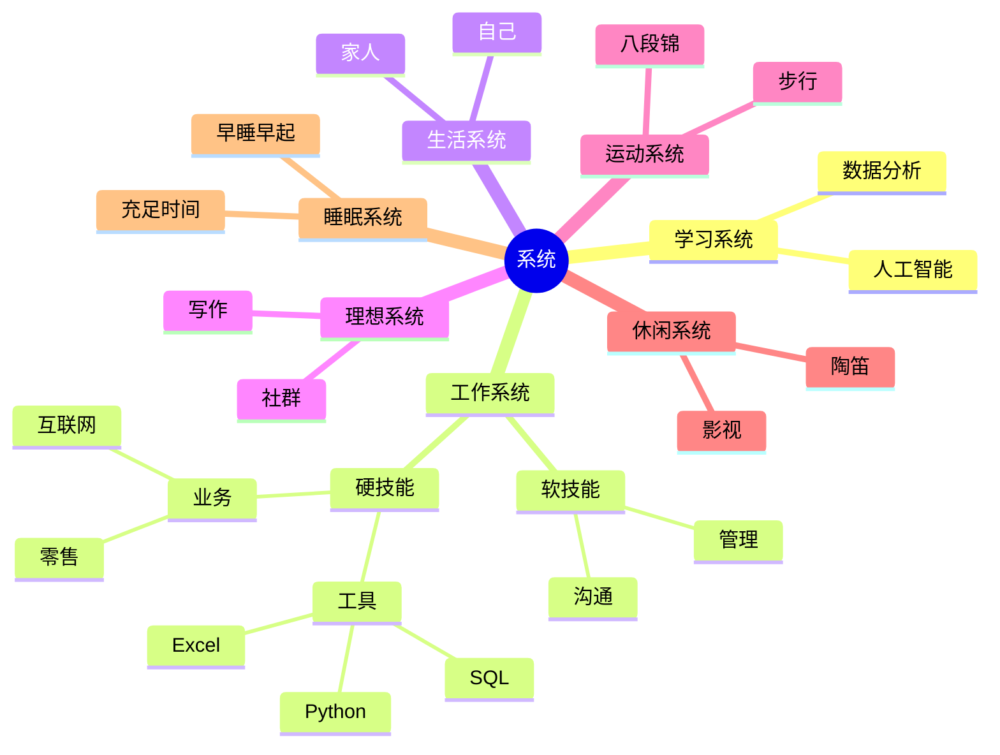

# 🔄 系统 system

## 1. 为何使用系统？

你知道自己的**时间**都去哪儿了？

你是不是有时会感到**情绪**低落？

你是不是想要做出正确的**选择**？

你是否希望养成一些好的**习惯**？

人们很容易就陷入到「**当局者迷**」的状态，不能很好地剖析自己，自然也就难以了解自我，而「数据化分析系统」则提供了一个很好的自我分析和觉察工具。

一旦你学会熟练运用「数据化分析系统」，就可以借助它的力量，让自己拥有更多专注时间，让情绪变得更加稳定，能做出正确的选择，从此以后，这个思维习惯可能会影响你的一生，从而获得确定性的成功。

下面是有系统和没系统的对比：

| **有系统** | **没系统** |
|-------|-------|
| 拥有更多专注时间 | 浪费很多碎片时间 |
| 情绪变得更加稳定 | 有时感到情绪低落 |
| 能做出正确的选择 | 因选择错误而后悔 |
| 养成一些好的习惯 | 难以培养好的习惯 |

管理大师彼得·德鲁克说过：「**如果无法量化它，就无法管理它。**」

「数据化」是自我量化的基础。从自我量化到自我认知，你需要客观理性地了解真实的自己。只有通过量化和真实的数据记录，你才能一点一点地去分析，从而能够更深入、准确地了解自己，从更加理性的角度去进行自我审视。

量化会吸引我们的注意力，并改变我们的行为。所以，我们不要为了量化而量化，而要思考量化的目标是什么，并选择合适的量化指标，定期问一问自己：这个指标的意义是什么？它有什么价值？

我们可以建立在「分析」的基础上，通过「系统」发现自己的优势，并充分发挥自己的潜能。

如果你能在自己具备天赋的领域，不断地进行刻意练习，就能逐渐建立自己的「护城河」，形成自己的核心竞争力。

记录可以促进思考，只要养成记录的习惯，就能不断提升思考的能力。

通过持续记录自己的时间、情绪和习惯，并重新审视自己之后，你可能会惊讶地发现，原来感觉中的自己，与量化和真实记录中的自己，是完全不一样的人。

**如果你能持续记录下去，就能拥有自己的大数据，用 ****AI**** 算法优化自己，也就能多出很多自由的时间，形成自我成长的闭环。**

假设你每天记录 20 行数据，每行数据花 15 秒钟，也就是投入 5 分钟左右的时间，带来的效果可能是每天多出 1+ 小时的专注时间，投资回报率高达 12 倍。

这样算下来，一年就能多出 365+ 小时，30 年就能多出 10000+ 小时，如果你能把这些时间投入到自己想做的事情上面，相信将足以让你过上更好的生活。

**时间是每个人最宝贵的资源，假设你每小时价值 1000 元，那么 10000+ 小时的价值就是 1000+ 万元。 **

利用「数据化分析系统」，学会驾驭自己的时间、情绪和习惯，只要你能驾驭其中任何一项，就可以获得丰厚的回报。

使用数据化分析系统，并不是要我们去完全按照它来生活，而是利用它来记录生活、改善生活和促进个人成长，让自己的生活变得更加幸福，而不是把自己活得像一个机器。

有很多人生活过得浑浑噩噩，不知道自己的目标是什么，日复一日、机械式地工作和生活，随波逐流，过得与机器没有本质的区别——没有自主的意识，缺乏独立思考的能力。

世界上最愚蠢的事，莫过于每天重复做相同的事，却期待出现不同的结果。

我们可以借助数据化分析系统，从数据记录中，发现自己内心真实的想法。

当我们真正知道自己想要什么的时候，也许就不会盲目地跟风，对未来也就不会感到迷茫，即使工作很忙碌，也不会感到碌碌无为。

**在我们人生的 3 万多天当中，大多数时候都是一些平常的日子，如果没有记录，这样的日子只会悄悄地滑过，不留下任何痕迹。**

**但是，一旦有了记录，这一天就会在生命中留下了印记，也就显得有些不一样了。**

你可以把每次记录时间，都当成一次反省自己的机会，每天多记录几次时间，就能及时调整自己的行为和状态，让自己快速成长。

**数据化分析系统的最大作用，就是能够在浪费时间、情绪失控或出现坏习惯的苗头时，能够及时地提醒自己，提升自己的心理能量，让自己重新回到正确的轨道上。**

数据化分析系统的核心理念是：

**用数据化解难题，**

**让分析更加有效。**

希望数据化分析系统能帮你：

**从数据中挖掘信息：有依据、可复制。**
**从信息中萃取知识：有逻辑、可论证。**
**从知识中获得智慧：有价值、可持续。**

## 2. 什么是系统？

「**数据化分析系统**」是一款**用来促进个人成长的数智化转型产品**，帮助用户**看见时间、洞见情绪、做出选择和预见习惯**，体验不一样的数智化人生。

该系统是林骥基于 Excel 制作，综合运用了《数据化分析》中介绍的 9 种思维和多元思维模型，通过对抽象事物进行量化打分，寻找其中的最优解，把一些重复性事务变成标准的流程，形成从感知数据到行动智慧的闭环，让自己越来越了解自己。

「数据化分析系统」有一个完整的闭环，可用于监测自己的行为，让行为更加符合自己的预期。

「数据化分析系统」主要用来改变个人行为，固化个人习惯，达成个人目标，包括以下几个特征：

（1）**更多的维度**：帮助用户增加信息的维度，系统总共分成 9 个大项，每个大项下面可以再细分为 20 个小项，最多支持 180 个项目类别，而且在每个类别后面，还可以再细分为 4 个象限，帮你实现更多维度的数据分析和更实用的功能。信息不只是事情的结果，还是做事的过程，还有情绪和习惯的记录，让更多维度的信息被映射、被链接到了一起。

（2）**更快的速度**：从数据的收集，到数据的分析，再到数据的展示，在数据化分析系统中，整个过程被「透明化」，在可被感知的状态下，实现更加便捷地记录时间和情绪，提升各个环节信息处理的速度。

（3）**更大的价值**：碎片时间和信息被整合，你不必花费大量的时间去回忆事件的经过，随时随地快速记录，并自动生成更美观的数据分析图表，让你把更多的时间和精力花在深度思考上面，发挥出更大的效能，**实现让生活更加幸福**。

「数据化分析系统」凝结了 100 多本相关书籍的精髓，还有我个人多年的实践心得，我自己深深地感受到该系统的强大，也享受着它带给我的种种好处，希望也能让你从中受益。

借助「数据化分析系统」，我能够公允地评价自己的状态，因为它给我提供了客观公正的数据。

比如，在 2020 年，我的工作时长高达 2812 小时，情绪能量是 880 分，习惯力量是 791 分；而到了 2023 年，我的工作时长是 2367 小时 12 分钟，情绪能量是 793 分，习惯力量是 816 分。

如果你不想肆意挥霍自己的时间，不想被情绪说绑架，不想成为习惯的奴隶，那么不妨试试运用数据化分析系统，学会驾驭自己而时间、情绪、选择和习惯。

「数据化分析系统」还在持续优化升级中，相关功能以最新版本为准。

## 3. 怎么使用系统？

人生有三见：**见自己，见天地，见众生。**

数据化分析系统也有三见：**看见时间、洞见情绪、预见习惯**。

关于数据化分析系统的具体使用方法，请点击查看：[上手指南](https://shujufuneng.feishu.cn/wiki/O7jawPMGbiHIdUkyAI8ciL4Entg)。

**无论你在什么时候遇到「数据化分析系统」，只要你愿意，随时都可以开始，即使中断了也可以继续，记录自己心路历程，成为更有智慧的人，让生活变得更加幸福。**

任何时间开始使用数据化分析系统都不算晚，无论人生还剩下多少时间，无论什么时候想要养成记录时间和情绪的习惯，都不算晚！而且，时间剩下越少，就越需要好好地珍惜它、利用它。

在记录的过程中，你不妨**扪心自问**：

我是谁？

我要去哪儿？

我要怎么去？

速度有多快？

我正在做什么事？

我为什么选择做这件事？

这件事是我自己主动选择做的吗？

如果今天生命的最后一天，我是否还愿意做今天要做的事？

假如答案连续多天为【否】，那么意味着你需要做出一些改变。

记住：**重点在于「记录」。**

你可以把人生中经历的事件，以及产生的情绪记录下来，然后去思考和挖掘它们之间的联系，形成一个生动的「故事」，把「过去的我」、「现在的我」与「未来的我」融合起来，让自己清楚地知道：

**在漫长的时间岁月里，每一个「我」都不是孤独的，有无数个「我」在为「当下的我」提供能量。**

当你记录之后，系统会让你看见自己的时间分布情况，洞见可能做出改变的地方，预见未来变得更好的状态。

很多人的成功是靠运气系统，而你使用数据化分析系统之后，就能形成系统的降维打击，从一个依靠直觉的运气系统，升级成一套依靠模型的算法系统，把未来巨大的不确定性，分解成无数个阶段性的确定性。

使用数据化分析系统，就像种下一棵树，你需要有足够的耐心，等待它慢慢成长。

种下一棵树最好的时间是 10 年前，其次是现在，使用数据化分析系统也是如此。

希望我们都能好好利用数据化分析系统，把它当成促进个人成长的利器，让自己成为一名「生活中的黑客」，用「数据分析」、「算法模型」和「系统思维」，「黑」进生活系统，轻松驾驭自己的时间、情绪、选择和习惯，成为更有智慧的人，从而过上更加幸福的生活。

最后，分享一个我的系统思维导图：

其中包括 7 个子系统：学习系统、工作系统、生活系统、理想系统、运动系统、休闲系统、睡眠系统，这些是我个人认为最重要的 7 个领域。通过收集和记录相关的数据，分析系统运行的状态，并根据数据持续优化系统，帮助我更好地驾驭自己的时间、情绪、选择和习惯，形成自我成长的闭环。

更新：2024-07-30

