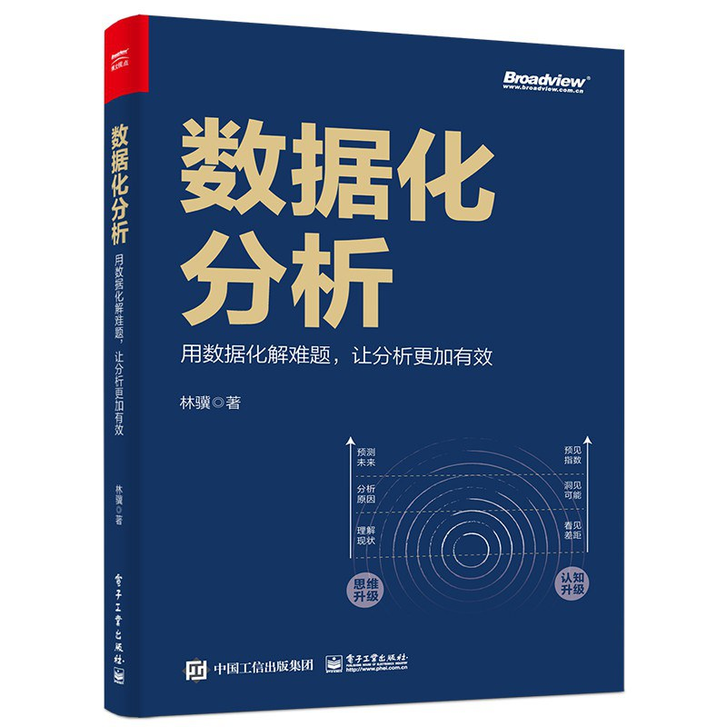
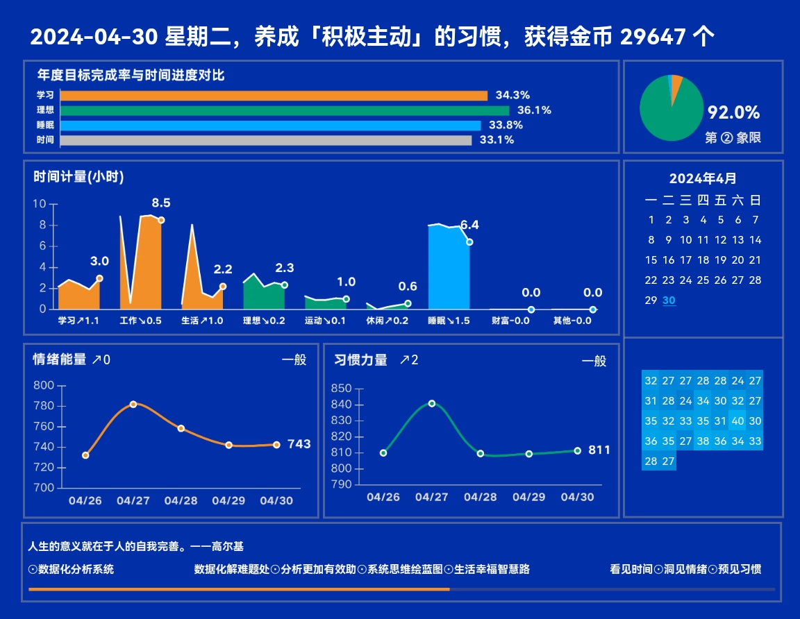
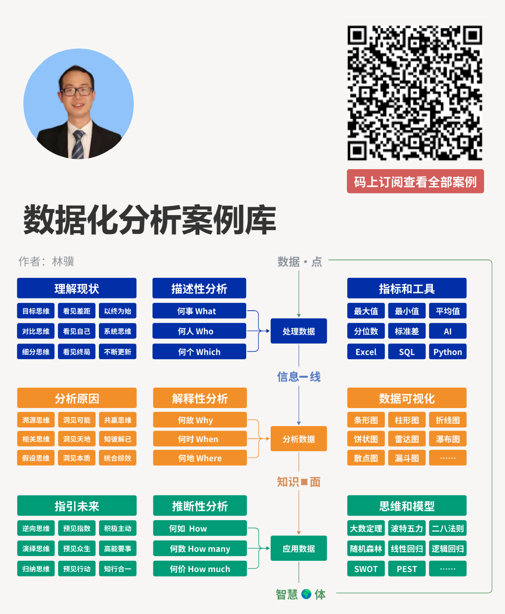

# 👤 林骥 linji

你好，我是《数据化分析》的作者林骥。

我对数据充满好奇，热衷于分析数据，喜欢发现数据背后的故事。另外，我比较喜欢学习和写作，非常享受学习的过程，也能沉浸在写作的心流之中。

我相信数据的价值，也相信知识的力量，更相信时间的复利。如果你也相信这些，那么我们就是同道中人，期待与你成为朋友，一起探索数据的奇妙世界，共同创造更加美好的未来。

在朋友们的眼中，形容我最多的 3 个词是：**自律、专业、严谨**。

### 一本书，数据化解难题处

总结我过去 15+ 年的数据分析经验，如果你想用数据化解难题，欢迎你查阅。

### 一个号，分析更加有效助

记录我数据分析的学习心得和思考，如果你想让分析更加有效，欢迎你订阅微信公众号。

[点击查阅 100 种分析思维模型系列文章](https://mp.weixin.qq.com/mp/appmsgalbum?\_\_biz=MzA4ODE2OTIxMw==\&action=getalbum\&album\_id=1701638273011351554#wechat\_redirect)

### 一个系统，系统思维绘蓝图

用「数据化分析系统」促进个人成长，如果你想驾驭时间、情绪与习惯，你可以加我微信（linjipro）获取授权。

### 一个星球，生活幸福智慧路

通过持续复盘，让自己过上更加幸福的生活。

另外，星球中包括一门视频课程《数据分析思维》，如果你想提升自己的认知水平，学会用数据分析思维洞察问题的本质，可以加入知识星球进行学习。

### 一个专栏，[数据化分析案例库](https://xiaobot.net/p/sjhfxalk)

如果你对我的个人经历感兴趣，可以继续看下面的简介。

### 时间线

2008 年，由于一个偶然的机会，我开始从事数据分析工作，从实习生做起，刚开始什么都没有，一无关系，二无背景，三无经验，就是一个普通的「**三无青年**」，但通过持续的努力和学习，我逐渐成长为一名团队管理者。

在成长的过程中，我遇到了很多困难和挑战，特别是在 2018 年，我陷入非常忙碌的状态，被各种琐碎的事务「推着走」，经常感觉时间不够用，我甚至觉得非常焦虑，感觉人都快要崩溃了，心理和身体状态都很差，对未来感到很迷茫。

我知道：\*\*人生可以忙，但不能茫。\*\*为了增强对时间的掌控感，我开始阅读很多相关的书籍，试用了很多相关的软件，然而结果却收效甚微，感觉永远都有做不完的事情。

直到我开始实践应用「**控制二分法**」：控制自己能控制的事情，专注精进；而不要妄图控制自己无法控制的事情，顺其自然。我才逐渐明确自己的目标，把时间和精力聚焦在真正重要的事情上，努力驾驭自己的时间、情绪和习惯。

从事数据分析工作 10 多年，我深知数据的重要性，因为**行动产生数据，数据发现规律，规律帮助决策，决策指导行动，周而复始。**

管理学大师彼得 · 德鲁克曾经说过：

> **认识你的时间，是任何人只要肯做就能做到的，这是通向贡献和有效性之路。**

\*\*一件事情，如果你无法度量它，就无法管理它。\*\*所以，我基于 Excel 表格软件，自主研发了一套「**数据化分析系统**」，用来记录自己的时间、情绪和习惯，对它们进行量化，并结合数据分析的思维、算法和图表，分析数据背后的规律，定期进行复盘总结，持续更新迭代，帮我作出更加明智的决策，然后付诸行动。

2023 年是我使用「数据化分析系统」的第 6 年，我已经累计记录了将 5 万多行的数据，正是因为有了这些珍贵的数据，我可以准确地知道，**在过去某天的几点几分：我在做什么事情？当时情绪怎么样？正在培养什么习惯？**

比如，2022-2-9 5:35，我开始重读《卓有成效的管理者》这本书，一边阅读，一边思考，一边写读书笔记，深度学习了 62 分钟，当时情绪是喜悦的，正在培养「以终为始」的习惯。

通过对这些数据进行分析和复盘总结，推动我不断进步，在记录时间、分析时间和规划时间的过程中，取得了事半功倍的效果。

**我发现自己最近 3 年做出的成果，比过去 10 多年还要多，并且都以数据和图表的方式，真实地记录了下来，这让我感到非常庆幸。**

感恩 2018 年处于焦虑状态的自己，在困难面前没有退缩，而是找到了合适的方法和工具，逐渐掌控自己的时间和情绪，养成了深度学习、用心写作和健身运动等习惯，让我获得成长。

在实践「数据化分析系统」的方法和工具之后，我逐渐走出了困境。

为了帮助其他遇到类似困难的人，我把「数据化分析系统」分享了出来，同时为了保护自己的时间和精力，所以我选择开通了一个付费的知识星球，并在星球上面对系统进行更新和优化迭代，希望和志同道合的人一起成长。

这个成长的过程，就像推动着一个巨大的飞轮，刚开始肯定会比较困难，但是一旦转动起来，我相信未来成长的速度会越来越快。

**如果你还对我的成长经历感兴趣，可以继续看下面更详细版本的故事。**

下面分几个不同的时期，分别讲一讲我的个人经历，并分享一些个人的发展经验，希望能够对你有所启发。

### **中小学时期**

我出生于 1982 年，是在一个偏僻落后的农村长大的，小时候放过牛，做过农活，生活过得比较艰苦，做了很多脏活、累活，但或许正是这段经历，培养了我能够吃苦耐劳的习惯。

我在中小学的时候，学习成绩不是很稳定，偏科比较严重，英语成绩比较差，理科成绩比较好，但高考发挥得还不错，考取了一所 211 大学，所学的专业是数学与应用数学。

### **大学和研究生时期**

上大学的时候，因为家里的经济比较困难，也能理解父母的辛苦和不容易，所以我的生活比较节俭，经常在外面做家教，赚一些生活费，而且学习比较刻苦努力，第一个学期的综合成绩在班上排名第一，后来每年都拿奖学金，做过学习委员，通过英语六级，成为优秀毕业生。

大学毕业之后，我做了 2 年老师，后来读硕士研究生，研究的方向是最优化方法，期间还参加了全国研究生数学建模大赛，获得二等奖。按照上海的落户政策，这个奖项可以加分，所以我可以把户口落在上海。

在研究生快要毕业的时候，我感觉自己的实践能力还比较弱，对未来感到很迷茫，不知道自己该做什么。

### **刚开始工作时期**

研究生毕业之前，我在招聘网站投了很多简历，发现就像石沉大海一样，杳无音信。

我对此进行反思，自己用这种广撒网的方式投简历，效果太差，应该学会聚焦，排除那些明显不适合自己的公司和职位，只保留一个求职方向。

因为我的专业是应用数学，感觉数据分析师这个职业挺适合自己的，所以我排除了其他选项，修改自己的简历，尽量去贴合数据分析师的要求。

通过聚焦，我终于找到了一份数据分析师的实习工作，刚开始实习的时候，把全部业余时间都用于学习 Excel、SQL 等数据分析工具，并在实际工作中应用，提升工作的效率。

### 工作进步时期

后来我意识到技术的进步是没有止境的，不能只关注技术，还应该培养其他能力，因为在不同的阶段，需要的能力结构也是不同的。

要获得进步，就要打破原来的能力边界。所以，我主动去与业务相关的人进行沟通交流，理解业务的需求和痛点，想办法解决业务中遇到的问题，让数据变得更有价值。

再后来，我做了团队的管理者，带领团队成员一起去完成更多更复杂的任务，遇到很多管理难题，开会、批评、辅导、激励、说服，事情繁杂，整个人感觉就像被撕裂一样，很难专注做一件事情，此时我迫切需要学习的是管理能力。

经过摸索和实践，我学习了一种 OKR 工作法，努力打造一个学习型的团队，让团队成员具有自我成长的能力，营造一种激发全员创造力和积极性的文化。

我努力把自己变成一个**教练型的研究者、设计者和联结者**，而不是命令型的控制者或监督者。通过了解宏观环境，拓宽知识视野，建立全局感、推动力和学习力，并结合适当的情绪管理，让自己获得稳步提升。

### 建立影响力时期

在努力工作的同时，我也在积极打破封闭的状态，努力在公司外面去建立自己的影响力。

2012 年，我开通了微博账号，网名叫「数据化分析」，寓意是对客观真实的数据，运用适当的方法和工具，进行科学有效的分析。

我用「数据化分析」这个网名在博客上发表文章，有的文章获得大量转发，当时一篇文章的最高阅读量有 5 万左右，让我在数据分析领域有了一点小小的影响力。

比较遗憾的是，当大家纷纷开始运营微信公众号的时候，我忙于解决现实中遇到的各种难题，在很长的一段时间内，基本放弃了写作，错过了借助微信公众平台放大影响力的黄金时间。

直到 2019 年，公众号的红利时期已经过去，我才逐渐恢复写作，开始在公众号上陆续发表一些原创的文章。

因为我不想被「数据化分析」这个标签束缚住我的写作内容，所以我把微信公众号的名字改成了「林骥」，这样只要是我认为对读者有价值的东西，我都可以自由写作，内容包括数据分析的思维、工具、模型、数据可视化、Python 编程、读书、复盘等，目前已经在公众号写了 300+ 篇原创文章。

2023 年，出版了我的第一本书\*\*《数据化分析：用数据化解难题，让分析更加有效》\*\*。

### **对未来的期望**

未来的路还有很长，我希望将来能够成为一个数据化分析大师，过上更加幸福的生活。

为什么是「大师」？而不是「专家」？

因为专家主要是指在某个方面有专业技能，有时会钻进死胡同，成为「砖家」。

而要想成为一个大师，不仅要专业造诣深厚，还要有知识创新，并且对社会贡献的价值更大。

我希望自己能够**坚持每天复盘，把每一次遇到的困难、挑战和痛苦，都当成提升自己的机会。**

**最后的话**

最后分享几点关于学习、复盘和成长的经验，希望能对你有所启发。

1. 学习要有**目标思维**，带着目标和问题去学习，这样效率更高。
2. **适当控制学习的难度**，有科学研究表明，如果学习时大约有 15.87% 的新知识，那么更容易进入心流状态，此时学习的效率最高。
3. 运用费曼学习法，**以教为学**，把自己学习的知识分享出来，教会他人，利他又利己，何乐而不为呢？
4. 懂得「**断舍离**」，知道知识是学不完的，专注于某一个细分领域，通过刻意的练习，达到精通的程度。人的时间和精力有限，不要想着什么事情都想做，结果什么都没有做好，不如精通一个方向，然后举一反三。
5. **学以致用**，把知识应用到实际的工作和生活中去。
6. 在学习中吸收新知，在讨论中提升认知，**在实践中检验知识**，形成正向循环。
7. 不要做一个工具人，而要做有自己思想的人，**用数据分析思维武装自己**，用数据促进个人成长。
8. 每天复盘，把每一次困难、挑战和痛苦，都当成提升自己的机会。通过复盘总结，对过去的行为进行反思，帮助自己适当修正未来的行动，并经过实践的验证，获得有价值的认知升级，做到**知行合一**，从而获得更快的成长。
9. 善用工具，比如用好「**数据化分析系统**」，优化自己的**时间、情绪、选择与习惯**。
