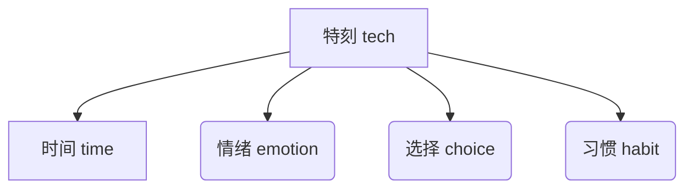

# ⏯️ 特刻 tech

```mermaid
flowchart TD
    B["特刻 tech"]
    B-->C["时间 time"]
    B-->D("情绪 emotion")
    B-->E("选择 choice")
    B-->F("习惯 habit")
```

特刻是「特殊时刻」的简称，也是 tech 这个英文简写的音译名，因为首字母分别代表：时间 time、情绪 emotion、选择 choice、习惯 habit。

**时间**记录容易「上手」；

**情绪**控制容易「上头」；

做出**选择**需要「上心」；

养成**习惯**需要「上身」。

把当下手头的事情做好，做到身心合一，就是值得过的特殊时刻。