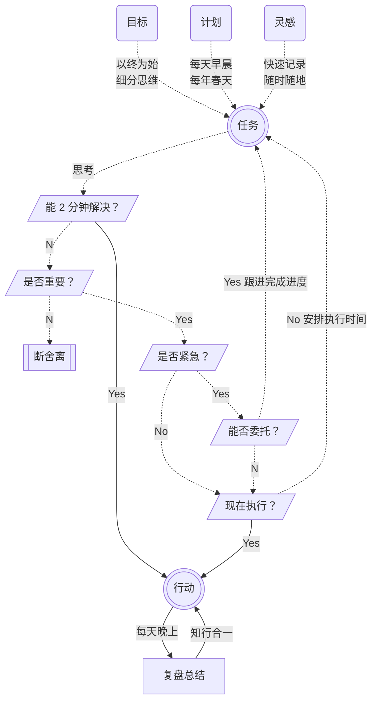

# 💎 时间 time

**关键词：价值、重要、紧急**

## 一个故事

下面讲一个故事，是我根据「时间布」的故事改编，这里把「布」改成「线」，是因为编织毛线比织布要简单一些，而且按照一般人的思维习惯，时间更像是线性的。

从前，有一个小孩叫小马，他总想让时间过得快一些，再快一些，特别是当遇到困难的时候，就希望这些时间能跳过去，只保留那些快乐的时间……

有一天，他做作业遇到难题，就躺下来休息一会儿，迷迷糊糊地看见一个白胡子的老爷爷，那个老爷爷对他说：「小马，你不是想让时间过得快一些吗？我来帮你。」

说着，老头拿出针和线：「给，这就是时间线，还有用来编织的针，你只要用针把时间线编织起来，时间就会立刻变快。不过你要记住，时间线一旦经过编织，就再也回不到从前了！」

小马赶紧拿起针和时间线，开始编织起来，果然，时间快速跳过去了，他不用感受做作业的痛苦，感觉非常高兴。时间很快过去了，小马想到明天还要考试，他又拿起针和时间线，把明天跳过去了。之后呢？他又想到上学不好玩，继续拿起针和时间线，把整个上学时期都跳过去了，直接变成一个大人。

在大人的世界里，小马在工作、生活、学习中遇到的难题，比以前还要多。于是，他又拿起针和时间线，不停地编织起来，突然，他发现时间线已经快到尽头了，自己已经变成老马了，老得甚至连拿针的力气都没有了。他后悔不已，想要解开那些已经编织好的时间线，但已经无能为力，急得他满头大汗，大叫一声……

惊醒之后，小马发现自己是做了一个长长的梦，从那以后，小马仿佛变了一个人似的，不再浪费时间，而是懂得善待时间，珍惜每一分每一秒，把握当下的时间，最后成了一个生活幸福的人。

生命是由时间组成的，每个人每天都有 24 个小时，总共 1440 分钟，如果把 5 分钟看作一个小点，那么一天就有 288 个小点，把这些小点连接起来，就变成一天的时间线。

就像小朋友们玩的「连点成线」游戏，按照画册中标注的数字，按照顺序画出线段，最终形成一个有意义的图形。

BMwQbvCgdocM6nxy3lFcQf0Rnif.png)

你无法控制时间的流逝，但你可以控制自己的注意力，把时间和精力用在更有价值的事情上面，让这一天过得更有意义。

根据《刻意专注》这本书的介绍，注意力有三个子系统：定向系统、警觉系统、执行系统，这让我联想到“三先”——先知、先觉、先行。

定向系统就像「手电筒」，让人聚焦当下的事物，知道目标是什么。

警觉系统就像「泛光灯」，让人关注周围的环境，感觉到环境的变化。

执行系统就像「开关键」，让人随时切换工作的状态，采取相应的行动。

你可以通过管理注意力的三个子系统，从而学会驾驭自己的时间，让自己把更多的时间花在更重要的事情上。

**如果你能长期坚持「高能要事」的习惯，在高效能的时间，做重要的、有价值的事情，你的人生注定会与众不同。**

反之，如果你经常浪费自己的宝贵时间，那么就很难获得幸福的人生。

你可以把时间记录当作一面「反光镜」，帮你看见时间的去向。

## 三个层次

### ① **以年为单位的时间管理**

每年制订新一年的行动计划，并且审视去年的实施情况。

### ② **以天为单位的时间管理**

每个人每天 3 个 8 小时。第一个 8 小时，大家都在工作，第二个 8 小时，大家都在睡觉。人与人的区别都是第三个 8 小时创造出来的。

如果你能从交通、睡觉、吃饭上分别省出一些时间并把它们花在学习上，那么你的进步速度将是惊人的。

### ③ **以小时为单位的时间管理**

每一个时刻我们只能做一件事情，如果被打断再转回来的时候，就会有一定的时间被浪费在回忆刚刚在做什么、做到哪里。

我们需要锻炼在不同事务之间迅速切换的本领，这样就会更加有效地利用每一个小时的时间，在每一个时间段里做到 100% 的专注。

借助工具，把事情分为「轻重缓急」，然后按照规律去依次处理。

PPcTbX3duoZW6sxCf5HcMYfBnPb.jpeg)

三种时间计量：小时、一天、年度；

三种自我感受：意识、心流、使命。

三种幸福人生：快乐、专注、意义；

做到三位一体，才能真正获得幸福。

## 四个阶段

### **① 知道为什么要做**

正确认识时间，意识到时间的宝贵，开始践行「**以终为始**」的理念，做好目标管理，让自己朝着正确的方向前进。

你不妨给自己策划一场「追悼会」，或者做一个「回到未来」的思想实验，用未来的视角看现在的自己，明确自己的人生目标，通过持续学习、思考、行动和感知，一步一步朝着终点前进。

### **② 知道做了些什么**

开始主动对时间进行规划，记录自己的时间、情绪和习惯，清楚地知道过去具体做了些什么，情绪怎么样，以及做出了什么成果，进而能够理性规划自己未来的时间。

你不妨尝试记录一下自己的时间，并做一个统计分析，也许很快就会发现，自己的有效时间其实少得可怜。

### **③ 知道怎么做更好**

学习时间管理的方法，并积极采取行动，当积累一定量的数据之后，就可以开始对数据进行分析，提醒自己按照「**要事优先**」的原则，给重要的事分配更多的时间，并专注做好当下的事，进而能够更加高效地利用好时间。

### **④ 养成思维微习惯**

把时间管理的理念融入到日常生活中，变成一种微习惯和潜意识的思维模式，让坚持变得更容易，能够随时随地进行记录，定期进行复盘总结，不断提升自己适应变化的能力。

## 四个象限

每次记录时间，都是一次反省的机会，每天多记录几次时间，就能及时调整自己的行为和状态，让自己快速改进。

比如，当我看完一段视频，记录自己看了多长时间，看到在表格中这段时间的价值为 0，就会提醒自己，以后这样的视频要少看。

要想更好地驾驭自己的时间，你需要每天进行复盘总结，回顾和分析当天各类时间的花费情况，知道今天做了什么事，做出了什么成果，当时的情绪怎么样，有没有坚持好的习惯，哪些事情应该继续做，哪些事情应该停止做，哪些事情应该开始做，哪些方面需要改进，四个象限的时间占比情况如何，等等。

艾森豪威尔是二战期间的五星上将，曾经连任两届美国总统，是一名著名的军事家和政治家，在历史上取得了非常卓越的成就。

为了把任务安排得井井有条，提高工作效率，艾森豪威尔提出了一种系统性的方法，即：通过分清楚任务的轻重缓急，整理出最重要的任务，并找出其中最关键的流程。

这种系统性的方法后来被称为**艾森豪威尔矩阵**，也被称为**时间管理优先矩阵**，或者叫**时间四象限法则**，其实就是运用数据分析的细分思维，把任务分成 4 个象限，然后分别采取不同的处理策略。

下面是每个象限对应的时间占比建议示意图：

V280bilJgoz6bCx6UIccUT2Bnsc.png)

矩阵上方代表我们生命中非常重要的事情。比如对我来说，深度学习、用心写作和健身运动都是非常重要的事情，需要积极主动地予以更多的关注，投入更多的时间和精力。

然而，一个人的时间和精力是极其有限的，我们不可能马上去做所有重要的事情。所以，我们需要按照任务的紧急程度进行细分，这样就得到了第 ① 象限和第 ② 象限。

### **第 ① 象限：重要而且紧急（马上做）**

比如，一些应急事项、马上就要交的方案、有限期的任务、紧要的会议等。

注意：此类事件不要积压太多，时间占比建议小于 15%，只有这样，才能腾出更多的时间去做重要但不紧急的事。

### **第 ② 象限：重要但不紧急（专注做）**

比如，读书、运动、写作、复盘、提前预防、长期目标、陪伴家人、关系的建立等。

此类事件通常做得越多越好，按照二八法则，建议花 80% 以上的时间专注于第 ② 象限的事情上，因为这类事情非常重要，但是当前并不紧急，所以很多人并没有引起足够的重视，等到它们转移到第 ① 象限时，可能发现为时已晚，导致后悔莫及。

比如，大家都知道锻炼身体的重要性，短期内不锻炼对身体影响不大，但是如果长期缺乏锻炼，等到身体生了大病之后，再去锻炼就已经晚了。

我们在安排这些重要但不紧急的任务时，一定要留有足够多的时间，专注把它们做好。

矩阵下方代表对自己没那么重要的事情，但并不代表对别人也不重要。别人肯定会对你说，这件事对你来说很重要，但真的有那么重要吗？这需要你自己做出判断，并为自己的选择负责。

确认一件事情真的不重要之后，就可以按照紧急的程度，进一步细分成第 ③ 象限和第 ④ 象限。

### **第 ③ 象限：不重要但紧急（委托做）**

比如，一些不重要的电子邮件、不重要的活动、凑热闹的会议等。

此类事件要尽量少做，建议比例控制在 5% 以内，如果条件允许的话，可以委托给其他人或者机器去做，比如，用扫地机器人帮我们扫地，用 Python 帮我们快速完成一些重复的工作，以便节省时间去做更加重要的事情。

### **第 ④ 象限：不重要不紧急（断舍离）**

比如，看一些无聊的八卦新闻、刷手机短视频、看长篇电视连续剧、做一些无关紧要的事情等。

此类事情最好少做，建议比例小于 1%，因为它们既不重要也不紧急，所以不做也没什么坏处，做了反而可能会影响你的注意力。

当然，我并不反对进行适当的休闲娱乐活动，而且我认为适当休息是一件很重要的事，关键在于是不是自己主动选择的？

如果是在完成阶段性的目标之后，自己主动选择进行适当的休闲娱乐活动，那么我觉得这是很有必要的，因为劳逸结合才能更加持久和高效。

反之，如果你是被机器算法所控制，一大早就开始不停地刷手机短视频，或者一天花了太多的时间用来看长篇电视连续剧或者小说，那么就需要注意了。

对于一件事情重要性的判断，跟一个人的价值观有关，不同的人看重的东西不一样，所以并没有统一的标准答案，关键是要明确自己的目标，搞清楚自己的内心到底想要什么。

如果你实在不知道什么才是重要的，那么不妨想象一个 80 岁的自己，扪心自问：“我会为这件事而感到遗憾吗？”

按照遗憾最小化原则，就能有效排除短期情绪波动的干扰，做出对长期更加有利的决策。对于自己真正热爱的事，我们通常不会因为失败而感到遗憾，但肯定会因为不去努力尝试感到遗憾。

在开始做一件事情之前，不妨问一问自己：我为什么要做？

**千万不要误把「紧急」当「重要」，要避免把太多的时间花在所谓的「紧急」任务上，这样才能真正驾驭自己的时间，提高时间的利用效率。**

除了按照重要和紧急来划分时间以外，我们还可以按照意义和快乐来划分时间。

### **第 ① 象限：有意义且快乐**

比如，冥想、锻炼等。

### **第 ② 象限：有意义但不快乐**

比如，工作、学习等。

### **第 ③ 象限：没意义但快乐**

比如，刷短视频、看电视剧等。

### **第 ④ 象限：没意义且不快乐**

比如，无聊会议、精神内耗等。

根据《时间贫困》作者的研究，一个人平均每天能有 2 到 5 小时的可自由支配时间，是最幸福的状态。

Av9dbISwboE92Jx64oocqpUcnKh.png)

可支配时间是指花在想做之事上的时间，包括放空、放松、运动、看电视、看电影或参加体育赛事等更积极的休闲活动，还包括和家人、朋友散步这样的纯社交活动，但不包括花在必要事务上的时间，例如接踵而至的工作、家务、看牙、就诊、跑腿等杂事，因为这些事都是非做不可的，为此消耗的时间也就算不上可支配时间。

运用数据化分析系统，你可以清楚地看见，自己的时间都去哪儿了，有了这些有用的（有时甚至是令人惊讶的）数据，你就能做出更加明智的决策，知道今后的时间应该怎么分配比较好。

## 四则运算

### ① 「加」效能

运用 SMART 法则，聚焦主要目标，做到知行合一。

### ② 「减」任务

学会「断舍离」，放弃一些不重要的任务，可以借助外力，委托他人去做，比如花钱买别人的时间。

### ③ 「乘」复利

养成良好的习惯，通过时间的积累，产生复利效应。

### ④ 「除」干扰

保持高度的专注，做好注意力和精力的管理，创造更多的心流时间。

## 时间人格

在《时间人格》这本书中，作者以科学数据为基础，提出了 4×4 时间人格，前 4 种代表「**预期**」的类型：

① 预期强：能强烈感觉到自己与未来的形象有联系。
② 预期弱：几乎感觉不到自己与未来的形象有联系。
③ 预期多：预计将来可能发生的事件数量比较多。
④ 预期少：预计将来可能发生的事件数量比较少。

### A 超载者

总是被时间追着跑，容易产生焦虑情绪，压力大。

预期强且多的人，就像一只勤劳不息的蚂蚁。

### B 自律者

能认真制订计划并完成工作，效率高，但有时会感受不到快乐。

预期强且少的人，就像一匹自律严格的马儿。

### C 躺平者

缺乏基本的工作动力，做什么都没干劲，不知不觉中虚度光阴。

预期弱且少的人，就像一只慵懒自在的树懒。

### D 享乐者

只喜欢做眼前轻松的工作，重要的任务进度容易停滞不前。

预期弱且多的人，就像一只享乐主义的猫咪。

后 4 种时间人格代表「**回忆**」的类型：

### E 自信者

勇于挑战困难的工作，但有时会因过于自信而失败。

回忆积极且正确的人，就像一只自信满满的小熊。

### F 恐惧者

擅长制订计划，但是害怕失败或批判，容易拖延。

回忆消极且正确的人，就像一只胆小谨慎的兔子。

### G 悲观者

不擅长估算时间，容易被不安和焦虑拖延。

回忆消极且错误的人，就像一只深思熟虑的猫头鹰。

### H 乐观者

经常会低估完成工作所需的时间，总觉得会有办法。

回忆积极且正确的人，就像一只乐观向上的狗狗。

下面是 20 道时间[人格测试题](https://timetest.zhiyuanbooks.com)，请根据实际情况，选择最符合自己的选项。

每题 1-5 分，1 代表完全不符合，5 代表完全符合。

第 1-5 题的总分，代表预期的强弱，第 6-10 题的总分，代表预期的多少。

第 11-15 题的总分，代表回忆是否正确，第 16-20 题的总分，代表回忆是否积极。

比如，第 1-5 题的总分是 20 分，第 6-10 题的总分是 8 分，因此预期人格是 B 自律者。

第 11-15 题的总分是 5 分，第 16-20 题的总分是 20 分，因此回忆人格是 H 乐观者。

按照**预期**与**回忆**的类型，两两进行组合，可以得到 16 种时间人格：超载的恐惧者、超载的自信者、超载的悲观者、超载的乐观者；自律的恐惧者、自律的自信者、自律的悲观者、自律的乐观者；躺平的恐惧者、躺平的自信者、躺平的悲观者、躺平的乐观者；享乐的恐惧者、享乐的自信者、享乐的悲观者、享乐的乐观者。

时间人格并非一成不变的，随着时间的推移，我们可能会变成另外一种时间人格。

不同的时间人格，对时间的感知和利用方式是不一样的，所以我们需要根据自身的实际情况，选择适合自己的时间管理方法，**以我为主，为我所用**。

日历比较适合预期现实感比较弱的人，待办清单比较适合预期过多和回忆消极的人，时间日志比较适合回忆偏差大或回忆积极的人。

我曾经是个预期强且多的「超载者」、回忆消极且错误的「悲观者」，后来借助「[数据化分析系统](../system/README.md)」，通过「断舍离」，变成了预期强且少的「自律者」、回忆积极且错误的「乐观者」。

待办清单让我能够减轻大脑的负担，专注做好当下的工作。

我常常低估完成任务所需的时间，时间日志让我能够及时回顾这些「确凿的证据」，避免对时间消耗的预估过于乐观。

无论什么方法，都有其适用的场合和范围。就算是手握一把倚天宝剑，也不适合用来做家常菜。了解自己的时间人格，选择合适的方法，才能起到事半功倍的效果。

## 最后的话

任何事情，如果想要有效改进，就要充分数字化。

当你养成记录时间和情绪的习惯，并分析一段时间之后，就能提升对时间和情绪的敏感度，进而找到改善时间和驾驭情绪的方法。

你不妨给时间定一个足够高的价格，这样可以让自己更加重视时间。

另外，找到自己的高效时间段，在高效时间段内做高价值的事情。

比如，我早上的思维最活跃，通常用来学习和写作思维模型。

**思维模型就像一张蓝图，我们可以在不同背景下加以运用，以便更好地理解这个世界，正确诠释有用的信息，了解事物的底层规律，给予我们一种可预测的结果。**

比如，食谱就是一种最基本形式的思维模型，每一种食材都有其作用，然而食谱并不适用于食品以外的领域。所以，我们需要学习多元思维模型，为各种情况做好准备。

学习和写作 100 种分析思维模型，是一种长期的脑力训练，可以帮助我们提升自己解决问题的能力，让我们保持长期乐观的心态，去面对现实世界的难题，不纠结，不慌张，不焦虑，看得全，看得开，超脱于事物的表面，洞察事物的本质。

为了更好地看见自己的时间，我把分析思维模型应用到「数据化分析系统」中，形成一种正向反馈的循环。

**强者征服今天，**

**懦夫哀叹昨天，**

**懒汉坐等明天。**

古罗马斯多葛学派哲学家塞涅卡说：「**对于那些忘记过去、忽视现在、害怕未来的人来说，生命非常短暂，令人焦虑。**」

真正有智慧的人，会把流逝的时间珍藏在记忆中，并好好利用当下的时间，坦然迎接即将到来的时间。

这应该是我们对待时间和情绪的正确态度，如果我们能养成这样的思维习惯，就不会有那么多的烦恼，也就不会活得那么焦虑了。

请你有意识地增加运动和睡眠时间，因为它们会影响你的情绪能量，有助于你更快乐地用好其他时间。

通过记录时间，分析自己的时间规律，顺应生物钟，在正确的时间，做正确的事，可以起到事半功倍的效果。

每天优先完成重要的事情，避免在愚蠢的事情上浪费时间，列出重要的待办清单，经过日积月累，形成复利效应，哪怕是每天微小的提升，只要经过长期的复合成长，就会产生巨大的价值。

在《钢铁是怎样炼成的》这本书中，作者奥斯特洛夫斯基写了一段令人印象最深刻的名言：

“人最宝贵的是生命。生命对于每个人都只有一次。人的一生应当这样度过：回首往事的时候，不会因为虚度年华而悔恨，也不会因为碌碌无为而羞愧。”

在《奇特的一生》这本书中，作者格拉宁写道：

“人最宝贵的是生命。倘若仔细分析我们的生命，则可以说，人最宝贵的是时间，因为生命由时间构成，是一分钟一分钟、一小时一小时累积而成的。”

古往今来，有无数人思考过关于时间的问题，并认识到时间的宝贵。

对酒当歌，人生几何？

希望我们每个人都能**不恋过去，不负现在，不惧未来，砥砺前行**，认真过好当下的每一天，努力成为一个更有智慧的人。

最后，分享一个我的时间管理流程图：

围绕任务和行动，形成知行合一的闭环。

我本人从这个时间管理流程中获益匪浅，以前迷茫、盲目、瞎忙的状态消失了，现在平均每天花 2 小时学习和写作，每天晚上复盘总结，让我感到生活非常充实而快乐，也让我感到自己有了更多的时间去做更重要的事情。

因为我借助「数据化分析系统」，驾驭好自己的时间、情绪、选择和习惯，所以学习和写作并没有打乱我的工作和生活，也没有减少睡眠和运动的时间，还有余闲兼顾看电影、练习乐器等兴趣爱好。

更新：2024-07-31

